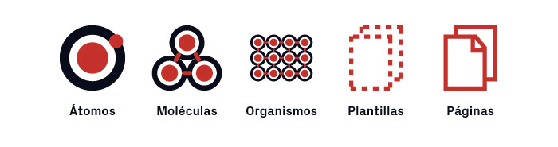
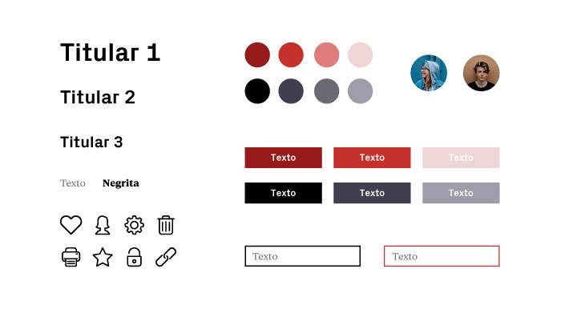
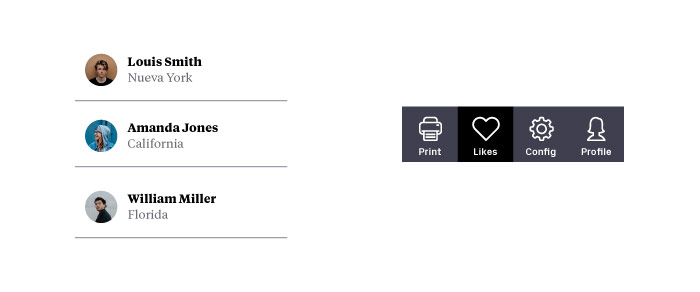

# [<](../../Readme.md) Atomic Design

Los componentes de React se ha decidido organizarlos acorde con lo establecido en Atomic Design. Se ha adjuntado un libro a la carpeta de documentación con una explicación detallada de en que consiste este tipo de diseño, está en la sección de recursos.

## Resumen sobre Atomic Design

### Nivel 1 Atomos

Un átomo es la unidad de partículas más pequeña que puede existir.

Aplicado al diseño, hablamos de átomos cuando hablamos de elementos UI que por sí solos tienen alguna funcionalidad: botones, cards, avatares, inputs de formulario… pero también las tipografías, paleta de colores, espaciados, párrafos…

Y, cada uno de ellos, tiene sus propias variaciones que representan estados: seleccionados, con foco, deshabilitados, etc.

### Nivel 2 Moléculas

Una molécula es una unión de dos o más átomos.

Del mismo modo, una molécula en Atomic Design es la unión de diferentes átomos para formar un elemento UI más complejo.

Por ejemplo, un campo de formulario con un botón de enviar y un label. O un rectángulo con un avatar, nombre y ubicación del usuario (es decir, avatar con texto en un área determinada). O un icono junto con un texto que ocupa una área determinada.

### Nivel 3 Organismos

Cuando llegamos al tercer nivel estamos hablando de elementos que son más complejos, ya que son sumas de los niveles anteriores.

No debemos perder de vista que estamos hablando de elementos de UI formados por moléculas (que a su vez son átomos) y que, por encima de todo, pueden repetirse.

En este sentido, podríamos considerar un organismo una unión de moléculas. Por ejemplo, cuando juntamos los rectángulos con el avatar y los nombres, cuando unimos los iconos y texto para crear una navegación de una aplicación, etc.

### Nivel 4 Plantillas

En esencia, lo que consideraríamos “plantillas” dentro del Atomic Design no dejarían de ser los wireframes: una unión de distintos organismos que forman una página o una aplicación.

Se trata de un entregable de alta fidelidad, pero que no termina de ser el diseño final. Para que nos entendamos, se trata del “esqueleto” de la aplicación o página web.

### Nivel 5 Páginas

Este es el último nivel del Atomic Design. Son en realidad el diseño final que ya contiene las imágenes y otros detalles que hacen que ese archivo ya esté listo para el desarrollo o, en su defecto, test con usuarios o el equipo.

### Recursos

[\\192.168.100.24\Analisis\PROYECTO\Devops\DOCUMENTACION\Formación\Libros de Frontend]()

[Atomic Design Ventajas y Desventajas](https://www.uifrommars.com/atomic-design-ventajas/)

# [<](../../Readme.md)