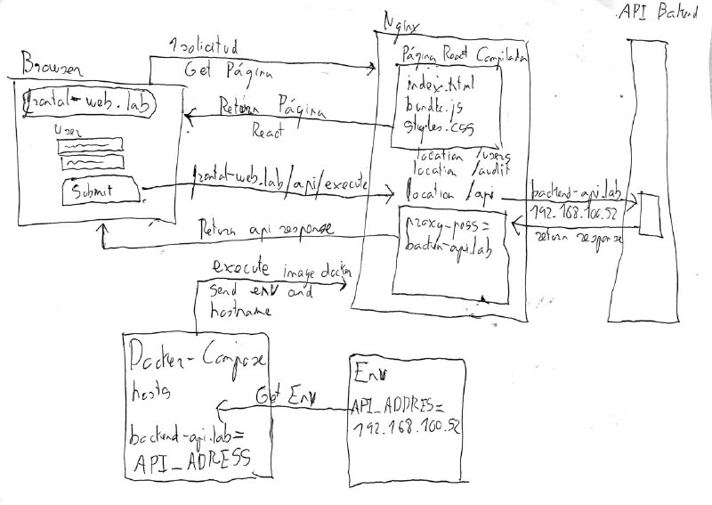

# [<](../../Readme.md) Configuración de desarrollo usando Docker Compose
## Prerrequisitos
Lo único que hace falta para tenerlo configurado en la máquina en la que estamos es lanzar los siguientes comandos de docker-compose. Además es necesario tener correctamente configurado el .env que podemos usar el .env.dist como base.

### Seleccionar El servidor de desarrollo, preproducción o producción
La forma de seleccionar el entorno sobre el que van a ir las peticiones es poniendo en el .env la IP del servidor de Backend de destino. Si ponemos la IP de desarrollo el frontal funcionará con desarrollo y si ponemos el de producción funcionará con producción. Este es el valor que tenemos que cambiar para ello.

URL_API
## Arrancar el servidor
Una vez con el .env activo solo hay que hacer los siguientes comandos.

```
docker-compose build
docker-compose up
```

Hay que tener en cuenta también que el backend en PHP está en los servidores de IZFE y hace falta tener una VPN o estar en su red.

## Como está construido

El docker-compose hace la construcción del DockerFile al target del nginx. Y el docker file tiene 2 targets. El primero se encarga de compilar el los archivos fuente en los dist y luego el target nginx copia el dist y lo expone.

En la configuración de nginx lo único que hacemos es exponer el HTML en todas las rutas salvo en las que hay que hacer conexión con la API. Ahí hacemos una redirección al servidor.

Hay una razón por la cual se ha decidido en el DockerFile hacer los Adds granulares. Para meter el menor contenido posible y agilizar el proceso y para no meter la configuración de Docker al copiar la base del proyecto al principio.
La razón es que un cambio en la configuración sino puede alterar la cache y forzar una reconstrucción de la imagen desde el principio que haciendolo de forma más granular nos lo ahorramos.

### Conexión con la API Rest

En el docker-compose le pasamos el .env con la URL_API y esta se pasa al fichero de hosts de nginx a un alias que es al que tiran las llamadas de API mediante un proxy inverso. Se hace en tiempo de ejecución con el CMD del DockerFile que extrae cual es su IP y la pone en el fichero de /etc/hosts.



# [<](../../Readme.md)
