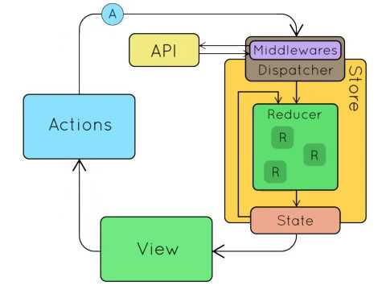

# [<](../../Readme.md) Api Middleware

Para simplificar la comunicación por API se descartó hacer uso de redux-thunk. Este framework permite lanzar promises a su propio middleware y que este dispache otras acciones en sus respuestas.
Redux-Thunk puede ser muy útil para el manejo de una API, sin embargo se consideró que aun con un coste mayor inicial de desarrollo de un ApiMiddleware este nos permitiría controlar mucho mejor el flujo constante entre que se lanza la petición, se espera a ella y se recibe un acierto o un fracaso.

El API Middleware funciona de la siguiente manera. Se le invoca lanzando un action con el API_REQUEST al principio del type e indicandole que tipo de petición es, (PUT, POST, GET, DELETE), así como pasandole la ruta y el body. Al mandar este action, el ApiMiddleware lo captura y construye con ello la llamada y la realiza. Y en los promises resultantes de acierto o error lanza un action con API_ERROR o API_SUCCESS con las respuestas y el contenido ya listos para que un reducer los escuche y capture y altere el estado.

De esta forma seguimos el siguiente gráfico.

## Las fases del API_MIDDLEWARE

- dispatch(ApiRequest): Lanzamos al dispatcher un api request con los datos necesarios para que esa petición se resuelva correctamente. Los actions los contruimos mediante métodos que delimitan que parametros reciben y construyen así siempre bien un action.
- Llega al api middleware el ApiRequest: 
    - Llega coge los datos construye la petición y la lanza
    - Incrementa en uno el contador de peticiones pendientes (Para mostrar la barra de carga)
- 2 posibles casos:
    - Se lanza el promise de resultado exitoso: 
        - Se lanza un action con la respuesta correcta
        - Se decrementa el contador de número de peticiones pendientes en 1
    - Se lanza el promise de error en la petición
        - Se lanza un action con la respuesta incorrecta
        - Se lanza la action que muestra una notificación de error al usuario
        - Se decrementa el contador de número de peticiones pendientes en 1
- Programamos un reducer que capture el API_SUCCESS o el API_ERROR y alteramos nuestro estado en consecuencia
- El resto react y redux se encargan de comunicarse los cambios y cambiar la interfaz con ello       

# [<](../../Readme.md)